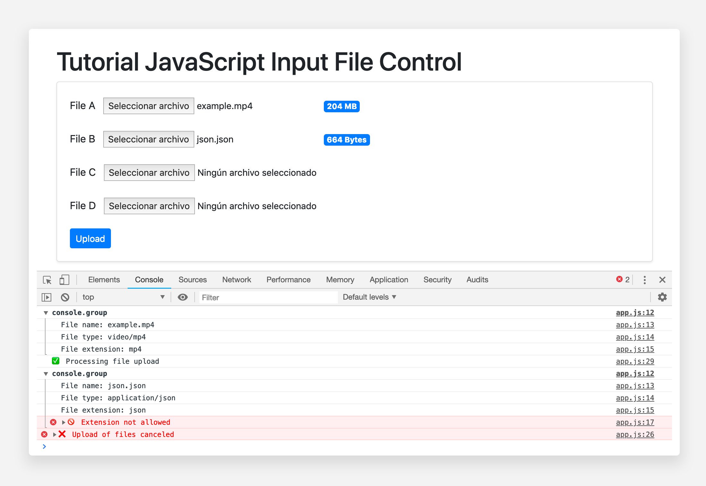

# Tutorial JavaScript Input File Control [](https://github.com/RichardLitt/standard-readme)

📂 Control with JavaScript the type of files, the extension and the weight of the file type inputs before uploading them to your server.



## Installation

```bash
npm i
```

## Run

```bash
npm run start
```

## Usage

Open: http://localhost:3000 

## More Info
[Mozilla Developers Element Input File](https://developer.mozilla.org/en-US/docs/Web/HTML/Element/input/file) \
[W3C Element Input File](https://www.w3.org/TR/2012/WD-html-markup-20120329/input.file.html)

## Maintainers
 \
[@JoseJPR](https://github.com/JoseJPR)

## Contact
🎓 Linkedin: https://www.linkedin.com/in/josejpr/ \
🐦 Twitter: https://twitter.com/JoseJ_PR \
📧 Send email to: me@josejpr.com

## License
[MIT](LICENSE.md)

## Happy Code
Created with JavaScript, lot of ❤️ and a few 🍺